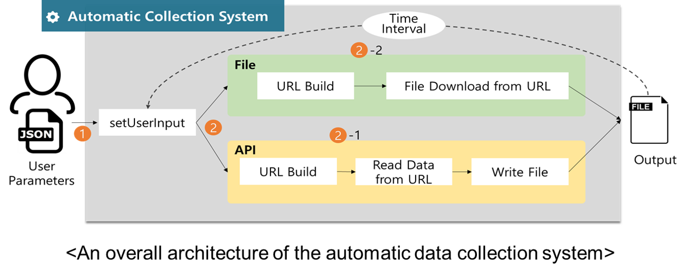
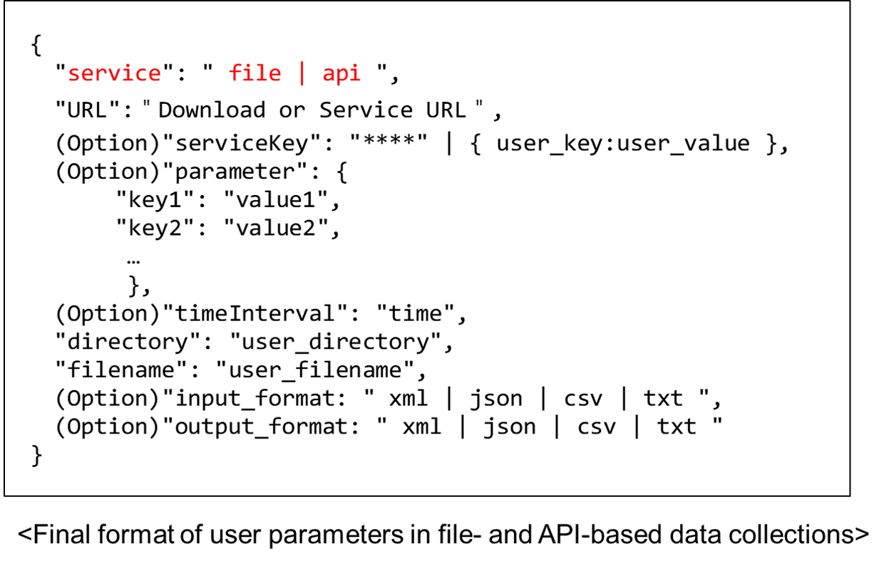


# Real-time Open Data Collector

실시간 공공 데이터 자동 수집 시스템
Real-time Open Data Collection System

(paper) [An Automatic Collection System for Open Data in Public Sector](https://github.com/Juhong-Namgung/realtime-opendata-collector/blob/master/paper/%5Bpaper%5DAn%20Automatic%20Collection%20System%20for%20Open%20Data%20in%20Public%20Sector.pdf)

(presentation) [An Automatic Collection System for Open Data in Public Sector](https://github.com/Juhong-Namgung/realtime-opendata-collector/blob/master/paper/%5Bpresentation%5DAn%20Automatic%20Collection%20System%20for%20Open%20Data%20in%20the%20Public%20Sector-Oral.pdf)

--- 
## 공공 데이터란
### 공공 데이터 
공공 기관이 만들어내는 모든 자료나 공적인 정보

### 공공 데이터 포털
 - 각 기관이 보유하고 있는 공공 데이터를 하나로 통합 관리하는 창구
 - 공공 데이터 포털을 통해 공공 데이터에 쉽게 접근 가능.
 - 한국([data.go.kr](http://data.go.kr)), 미국([data.gov](http://data.gov)), 호주([data.gov.au](http://data.gov.au))
### 공공 데이터 제공 방식
 1) 파일 데이터: 활용 가능 공공 데이터를 파일 형태로 다운로드
 2) 시각화: 공공 데이터를 그리드, 차트 형태로 표현
 3) 오픈 API: 누구나 사용할 수 있도록 공개된 응용 프로그래밍 인터페이스, 
                       실시간으로 업데이트되는 데이터 제공 
                       


## 공공 데이터 자동 수집 시스템

 * 파일 기반 데이터: URL을 통한 파일 다운로드
 * API 기반 데이터
	 * (1) API Key 신청
	 * (2) 서비스 URL, request parameter 정의
	 * (3) API Key와 URL 기반으로 API 호출
	 * (4) API 결과 데이터를 파일 형태로 저장

### 공공 데이터 자동 수집을 위한 시스템 제안


#### 입력 JSON 구조
1) File-based

2) API-based

3) File/API 동시 지원



#### 타입 변환 지원
1) XML to CSV
2) JSON to CSV

--- 
## 사용법


``` bash 
$ git clone https://github.com/Juhong-Namgung/realtime-opendata-collector.git
$ cd realtime-opendata-collector/
$ java -cp "./libs/*:./exec/data-collector.jar" main.Collector {input_json_file_path}
'''

